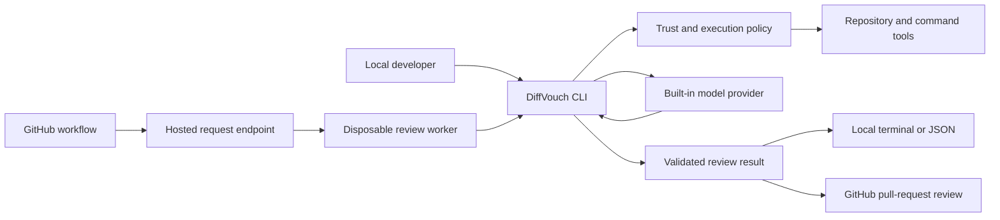

# DiffVouch review architecture

## Purpose

DiffVouch should contain the complete code-review runtime. It should collect and
understand changes, inspect repository context, run allowed validation commands,
communicate directly with the selected model provider, validate the result, and
optionally publish the review to GitHub.

Codex CLI and Claude Code may be offered as optional transports, but neither is
required. The normal local and hosted paths use provider APIs implemented inside
DiffVouch and do not depend on an external agent harness.

The hosted deployment is intended for repositories owned by the same person or
organization as the workers. It can also review third-party repositories, using
a more restrictive policy selected from service-owned configuration.

## Design principles

- One review engine serves local and hosted invocations.
- DiffVouch owns the model conversation and tool-execution loop.
- GitHub Actions only requests a review; it never receives model credentials or
  calls a model provider.
- Repository trust is configured outside the repository being reviewed.
- Trusted repositories may be built, tested, and executed in disposable
  workspaces.
- Third-party code is readable for review but cannot execute by default.
- Access to the complete repository does not expand review scope: findings must
  still be caused, exposed, or materially worsened by the selected change.
- The initial hosted service has no application database.

## System overview



The CLI is the review runtime in both cases. The hosted endpoint only validates
and schedules requests, while a worker prepares a checkout and invokes the CLI.

## Model providers

DiffVouch should expose a provider interface that supports normal messages,
structured output, and tool calls:

```go
type ModelProvider interface {
    Respond(context.Context, ModelRequest) (ModelResponse, error)
}

type ModelRequest struct {
    Model        string
    Conversation []Message
    Tools        []ToolDefinition
    OutputSchema any
}
```

Built-in transports should include:

- OpenAI API.
- Anthropic API.
- An OpenAI-compatible HTTP endpoint.
- Optional Codex CLI transport.
- Optional Claude Code transport.

Example selection:

```bash
# Built-in provider; no external CLI is required.
diffvouch review --provider openai --model MODEL

# Optional external transports.
diffvouch review --provider codex-cli
diffvouch review --provider claude-cli
```

The review engine, rather than the provider adapter, owns the loop:

1. Build the initial prompt from the diff and trusted review policy.
2. Send the available tool definitions to the provider.
3. Execute requested tools under the effective repository policy.
4. Return tool results to the provider.
5. Repeat within configured turn, time, and output limits.
6. Validate the final result against the DiffVouch review schema.

This keeps repository exploration and behavior consistent across providers.

## Repository tools

DiffVouch supplies the tools needed to understand and verify a change:

| Tool | Purpose |
|---|---|
| `read_file` | Read a complete file or a bounded line range. |
| `search_code` | Search paths and file contents. |
| `list_files` | Discover repository structure. |
| `git_diff` | Inspect the selected change. |
| `git_show` | Read a path from the base or head revision. |
| `find_references` | Locate callers and uses of a changed symbol. |
| `run_command` | Run an allowed command in a trusted workspace. |
| `run_validation` | Run configured build, test, lint, or analysis commands. |

The model can inspect as much context as required within resource limits. Full
repository access is used to verify findings, while comments remain limited to
the selected diff.

## Repository trust configuration

Trust is stored in a host-level or user-level configuration file. It must not be
controlled by `.diffvouch.yml`, a workflow input, or a pull-request change.

```yaml
repositoryTrust:
  default: untrusted

  trustedOwners:
    - githubOwnerId: 12345
      name: my-organization

  repositories:
    - githubRepositoryId: 67890
      name: partner/shared-library
      mode: trusted

    - githubRepositoryId: 98765
      name: my-organization/security-research
      mode: untrusted
```

GitHub numeric IDs are authoritative because names can change. Names are kept in
the file for readability.

Rules are evaluated in this order:

1. Exact repository rule.
2. Repository-owner rule.
3. Default mode.

For a pull request, DiffVouch evaluates both the base repository and the head
repository. The effective mode is untrusted when either side is untrusted. This
means a pull request from an unknown fork is handled as third-party code even
when its base repository belongs to a trusted organization.

The hosted service resolves trust from its mounted configuration. A local user
can use the same configuration and may explicitly select a mode for one run:

```bash
diffvouch review --repo-trust trusted
diffvouch review --repo-trust untrusted
```

A hosted workflow request cannot override the service decision.

## Trusted repository execution

A trusted review runs in a fresh, writable workspace. DiffVouch may read the
whole repository, install dependencies, build the code, run tests, and execute
configured project commands.

```yaml
execution:
  trusted:
    allowCommands: true
    allowNetwork: true
    timeout: 20m
    maxOutputBytes: 10485760

  untrusted:
    allowCommands: false
    allowNetwork: false
```

Repository-specific validation commands may be read from the trusted base
revision of `.diffvouch.yml`:

```yaml
review:
  validation:
    - go test ./...
    - go vet ./...
```

Trusted mode does not require file allowlists, a restricted context reader, or a
ban on repository scripts. Operational limits still protect the worker from a
stuck build and ensure the result corresponds to the intended commit:

- Use a disposable workspace for every review.
- Apply CPU, memory, output, and time limits.
- Review the exact base and head commit IDs.
- Recheck the pull-request head before publishing.
- Validate the model's structured output.
- Remove the workspace after completion.

## Untrusted repository execution

Third-party repositories run with a restricted policy. DiffVouch may read and
search source code, but it does not execute repository commands or allow model
tools to access the network.

The untrusted policy also protects host credentials and blocks access outside
the temporary checkout. Model context is redacted before it leaves the worker.
These restrictions apply to third-party repositories and unknown fork heads;
they are not imposed on repositories explicitly marked trusted.

## Local invocation

A local review runs the engine directly in the current checkout:

```text
Developer -> DiffVouch CLI -> repository tools -> model provider -> output
```

DiffVouch performs the following work:

1. Resolve the repository and requested diff.
2. Resolve trust from user configuration and any explicit local override.
3. Load review instructions from the trusted comparison revision.
4. Make repository and execution tools available according to policy.
5. Run the provider-independent review loop.
6. Validate, render, and optionally publish the result.

The local user can select a built-in provider or an optional external CLI
transport. All prompt construction, context access, command execution, scoring,
and result validation remain inside DiffVouch.

## GitHub-triggered invocation

The repository contains a small dispatcher workflow:

```yaml
name: DiffVouch

on:
  pull_request_target:
    types: [opened, reopened, synchronize, ready_for_review]

permissions:
  contents: read
  id-token: write

jobs:
  request-review:
    if: github.event.pull_request.draft == false
    runs-on: ubuntu-latest
    steps:
      - name: Request DiffVouch review
        uses: diffvouch/request-review@PINNED_COMMIT_SHA
        with:
          endpoint: https://diffvouch.example.com
          pull-request-number: ${{ github.event.pull_request.number }}
```

This workflow does not check out the repository, execute pull-request code,
contain provider credentials, or call a model API. The pinned action obtains a
short-lived GitHub identity token and sends only the repository identity, pull
request number, and workflow-run identity to the hosted endpoint.

The endpoint accepts a small request:

```http
POST /v1/github/reviews
Authorization: Bearer GITHUB_OIDC_TOKEN
Content-Type: application/json

{
  "repositoryId": 12345,
  "pullNumber": 42,
  "workflowRunId": 98765
}
```

The service verifies the GitHub identity and independently retrieves the pull
request's canonical base, head, repository, and installation information. It
does not trust commit IDs, repository URLs, model selections, prompts, or trust
settings supplied by the workflow.

## Hosted worker lifecycle

Each accepted request starts a disposable worker:

1. Obtain a short-lived GitHub App installation token.
2. Fetch the exact base and head commits into a temporary checkout.
3. Resolve the trust policy for both repositories.
4. Select the provider and validation policy from host configuration.
5. Run DiffVouch in the checkout.
6. Recheck that the pull-request head has not changed.
7. Publish the validated review through the GitHub App.
8. Remove the checkout and credentials.

An internal invocation can look like:

```bash
diffvouch review-pr \
  --repo owner/repository \
  --pr 42 \
  --config /etc/diffvouch/config.yml
```

The GitHub App needs `Contents: Read` to fetch code and `Pull requests: Write`
to publish reviews. `Checks: Write` is optional when the service reports queued,
running, and completed states through GitHub Checks.

When a new commit arrives, its head commit ID creates a new review job. Before
publishing, the worker discards a result whose reviewed head is no longer the
current pull-request head.

## Configuration without a database

The initial service uses files and existing platform state:

```text
/etc/diffvouch/config.yml     Trust, provider, execution, and review settings
/etc/diffvouch/secrets/       Mounted GitHub and provider credentials
GitHub                       Pull-request and publication state
Process or job runner        Active execution state
Temporary workspace          Per-review checkout and output
Standard logs                Diagnostics
```

A bounded in-memory queue is sufficient for a single service process. A
container platform may instead represent each request as a job and use a
deterministic name derived from repository ID, pull-request number, and head
commit ID. That name prevents duplicate work without application storage.

The GitHub workflow may retry a request after a service restart. DiffVouch checks
the pull-request head and existing review marker before publishing, making a
retry safe.

A database would only be needed for product features that require durable,
queryable application state, such as:

- Multiple customer accounts and organization membership.
- Billing, quotas, and usage history.
- A long-term searchable review archive.
- Cross-worker scheduling that cannot be delegated to the job platform.
- Custom settings edited through a hosted dashboard.
- Audit and analytics queries across many installations.

Those features are outside this architecture. Trust and execution policy are
maintained in a mounted configuration file, GitHub remains the source of pull
request state, and workers remain disposable.

## Suggested implementation boundaries

```text
cmd/diffvouch/             Local CLI and worker entry points
internal/provider/         Built-in API and optional CLI transports
internal/agent/            Provider-independent conversation and tool loop
internal/tools/            Repository, Git, search, and command tools
internal/trust/            Trust matching and execution policy
internal/worker/           Hosted job lifecycle
internal/github/           PR resolution, checkout credentials, and publishing
```

The current prompt and output schema can remain shared. The prompt should permit
repository inspection and command execution when the active policy exposes
those tools, while preserving the rule that findings must be caused by the
reviewed change.
